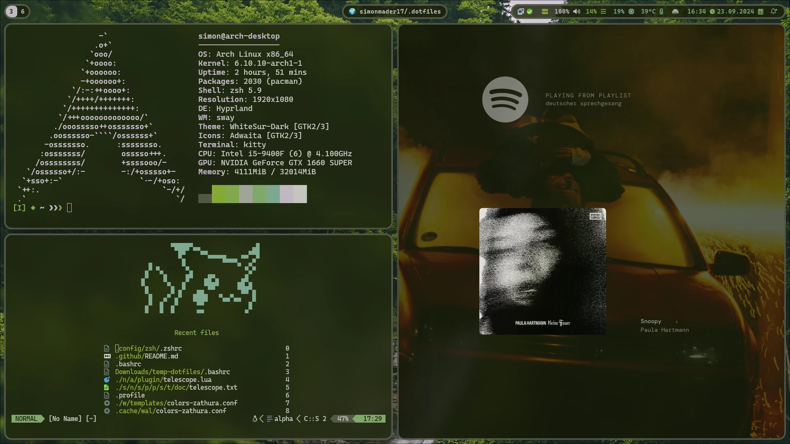

# `.dotfiles` 🖌️

 

Recreate this setup:

```
git clone --bare git@github.com:simonmader17/.dotfiles.git $HOME/.dotfiles
alias dotfiles='/usr/bin/git --git-dir="$HOME/.dotfiles/" --work-tree="$HOME"'
dotfiles checkout
dotfiles submodule update --init --recursive
dotfiles config --local status.showUntrackedFiles no
```

To overwrite your local config files, do this instead:

```
dotfiles checkout -f
```
