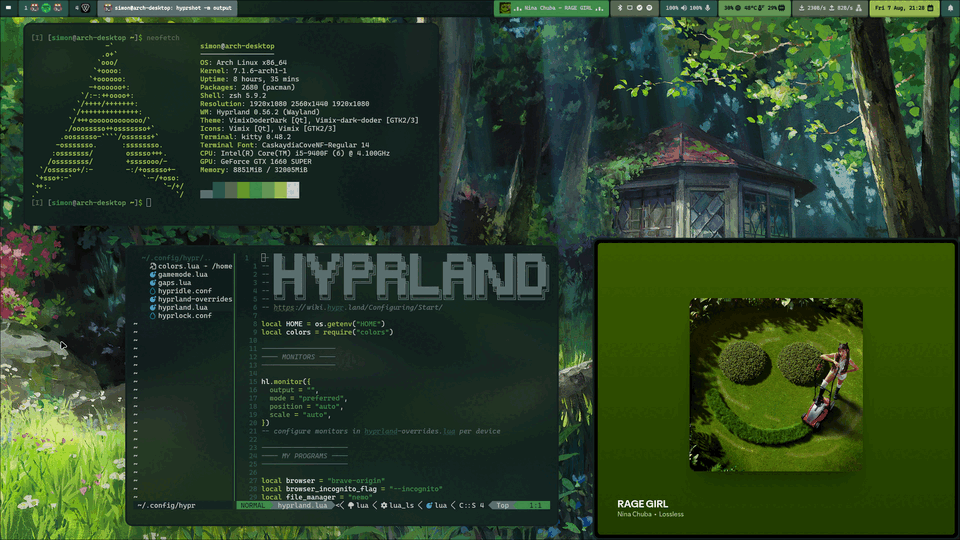

# `.dotfiles` 🖌️



## Installation

Clone the repository as a bare repo and set up an alias to interact with it:

```
git clone --bare https://github.com/simonmader17/.dotfiles.git $HOME/.dotfiles
alias dotfiles='/usr/bin/git --git-dir="$HOME/.dotfiles/" --work-tree="$HOME"'
dotfiles checkout
dotfiles submodule update --init --recursive
dotfiles config --local status.showUntrackedFiles no
```

If `checkout` fails because files already exist in `$HOME`, either back them up
or force-overwrite your local config files:

```
dotfiles checkout -f
```

## Usage

Once the alias is set, use `dotfiles` exactly like `git`, from anywhere in your
home directory:

```
dotfiles status
dotfiles add .config/nvim/init.lua
dotfiles commit -m "Update Neovim config"
dotfiles push
```
